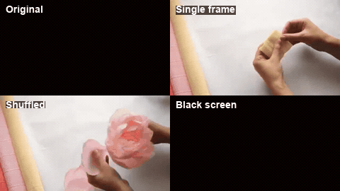

# Accuracy Without Grounding

Code, predictions, analysis, and paper artifacts for:

**Accuracy Without Grounding: Diagnosing Visual Dependency Dissociation in Video LLM Benchmarks**  
Jae Joong Lee, Department of Computer Science, Purdue University  
Accepted at ACM Multimedia 2026

[](LICENSE)
[](https://www.python.org/)
[](paper/main_arxiv.pdf)

**[Project website](https://www.jaejoonglee.com/acmmm-vdg/)**

## Overview

Video LLM benchmark accuracy is commonly treated as evidence of visual understanding. This
repository audits that assumption by evaluating each model twice: once with the original video
and once with a duration-matched black video. The difference is the Visual Dependency Gap:

```text
VDG = accuracy(original video) - accuracy(black video)
```

A high VDG means that removing the visual stream destroys correct answers. A VDG near zero means
that the video adds little measurable value under the tested benchmark and inference protocol.
Negative VDG means that the model performs better without the video.

The study covers 20 models from 2B to 78B parameters, ten architecture families, Video-MME,
MVBench, and EgoSchema. It also evaluates H.264 compression, frame-rate ablations, and a four-step
diagnostic ladder:

```text
black screen -> single frame -> shuffled frames -> original video
```

The ladder separates spatial information, frame diversity, and temporal order.

[](https://www.jaejoonglee.com/acmmm-vdg/)

*Temporal Reasoning example: "What is the right order of the tools appearing in the video when
making a paper peony?" Qwen2-VL-7B answers correctly under all four conditions, including the
black screen (VDG = 0). Click the animation to explore the complete interactive results.*

## Main findings

- Accuracy and visual dependency can dissociate: models with similar or better benchmark accuracy
  do not necessarily obtain more value from the video.
- Task types form a stable VDG spectrum across architectures. Attribute Perception is strongly
  visual, while Temporal Reasoning is often close to the language-only baseline.
- Frame diversity contributes much more than temporal ordering for the evaluated models and tasks.
- Flat aggregate compression curves conceal bidirectional question-level answer flips.
- API-accessed and open-weight models span a wide VDG range; API access alone does not imply better
  grounding.

The paper uses VDG as the final metric name. Some early scripts and result fields use `VGG`
(Visual Grounding Gap); both names refer to the same original-minus-black calculation.

## Repository contents

```text
accuracy-without-grounding/
|-- README.md
|-- LICENSE
|-- requirements.txt
|-- data/
|   |-- README.md
|   `-- videomme/full_sample.json
|-- results/
|   |-- README.md
|   |-- full_study/        # Video-MME raw predictions and ablations
|   |-- mvbench/           # MVBench raw predictions
|   |-- egoschema/         # EgoSchema raw predictions and summary
|   `-- experiments/       # FPS, scale, and API-model summaries
|-- src/
|   |-- pilot/             # original 60-question pilot
|   |-- videomme/          # 600-question main pipeline
|   |-- mvbench/           # download, preparation, inference, analysis
|   |-- egoschema/         # preparation, download, inference, analysis
|   |-- experiments/       # model-scale and FPS experiments
|   |-- proprietary/       # OpenRouter evaluation
|   `-- utils/             # diagnostics and environment checks
|-- analysis/              # paper statistics and robustness checks
|-- cluster/               # standalone GPU-cluster runners
```

Raw benchmark videos and model weights are intentionally excluded. The small question sample,
raw prediction JSON files, aggregate CSV files, and the README demonstration are included.

## Quick start: reproduce analysis without a GPU

The bundled predictions are sufficient to reproduce the main statistical analyses. Run commands
from the repository root so the default `data/` and `results/` locations resolve correctly.

```bash
git clone https://github.com/JaeLee18/accuracy-without-grounding.git
cd accuracy-without-grounding

python -m venv .venv
source .venv/bin/activate                 # Linux/macOS
# .venv\Scripts\Activate.ps1             # Windows PowerShell

python -m pip install --upgrade pip
python -m pip install numpy scipy pandas statsmodels matplotlib

# Recompute the Video-MME table values and confidence intervals.
python analysis/recompute_full_table1.py
python analysis/recompute_vgg_cis.py

# Reproduce paired dissociation and sensitivity analyses.
python analysis/mcnemar_sensitivity.py
python analysis/compute_acc_ci.py

# Reproduce benchmark-specific summaries.
python src/mvbench/analyze_mvbench.py
python src/egoschema/analyze_egoschema.py
```

Additional analyses are in `analysis/`. The cumulative interpretation is recorded in
`analysis/findings_all.md`.

## Full installation for model inference

Inference requires Python 3.10 or newer, an NVIDIA GPU, a working CUDA installation, and enough
VRAM for the selected model. Install PyTorch for the CUDA version on your machine first, then the
remaining dependencies:

```bash
# Example only: choose the PyTorch command matching your CUDA installation.
python -m pip install torch torchvision --index-url https://download.pytorch.org/whl/cu121
python -m pip install -r requirements.txt
```

Model-family notes:

- Qwen scripts require `qwen-vl-utils`.
- InternVL scripts load Hugging Face remote model code and may require model-specific dependencies.
- LLaVA-Video scripts import the upstream `llava` package; install the official LLaVA-NeXT/
  LLaVA-Video environment before running them.
- `src/pilot/find_semantic_pairs.py` additionally requires OpenAI CLIP. Its optional installation
  line is documented in `requirements.txt`.
- Models above 26B may require 4-bit `bitsandbytes` loading or multi-GPU sharding.

Check the environment before long runs:

```bash
python src/utils/check_cuda.py
python src/utils/check_env.py
python src/utils/test_ffmpeg.py
```

## Portable path configuration

No script contains a user-specific filesystem path. Commands are expected to run from the
repository root and use these defaults:

| Environment variable | Default | Purpose |
|---|---|---|
| `VDG_DATA_ROOT` | `data` | prepared samples, downloaded videos, and derived videos |
| `VDG_RESULTS_ROOT` | `results` | prediction checkpoints, summaries, and plots |
| `VDG_VIDEOMME_SRC` | `data/raw/Video-MME` | raw Video-MME parquet and zip chunks |
| `FFMPEG_BIN` | bundled `imageio-ffmpeg` executable | optional explicit FFmpeg executable |
| `OPENROUTER_API_KEY` | unset | required only for proprietary API evaluation |

Override the defaults when datasets live outside the clone:

```bash
# Linux/macOS
export VDG_DATA_ROOT=/data/vdg
export VDG_RESULTS_ROOT=/data/vdg-results
export VDG_VIDEOMME_SRC=/data/raw/Video-MME
export FFMPEG_BIN=/usr/bin/ffmpeg
```

```powershell
# Windows PowerShell
$env:VDG_DATA_ROOT = "$HOME\datasets\vdg"
$env:VDG_RESULTS_ROOT = "$HOME\results\vdg"
$env:VDG_VIDEOMME_SRC = "$HOME\datasets\Video-MME"
$env:FFMPEG_BIN = "ffmpeg"  # resolved from PATH
```

The `cluster/` package uses `DATA_ROOT` and `RESULTS_ROOT`; `cluster/run_all.sh` initializes both
to directories inside `cluster/` unless they are already set.

## Expected data layout

With the default configuration, preparation scripts create or consume:

```text
data/
|-- raw/Video-MME/
|   |-- videomme/test-00000-of-00001.parquet
|   `-- videos_chunked_*.zip
|-- videomme/                     # pilot data
|-- videomme_full/
|   |-- full_sample.json
|   |-- videos/
|   |-- crf18/ crf23/ crf28/ crf33/ crf38/
|   `-- ablation/
|-- mvbench/
|   |-- raw/
|   |-- videos/
|   `-- mvbench_available_sample.json
`-- egoschema/
    |-- egoschema_subset.json
    |-- videos/
    `-- black/
```

The repository already contains `data/videomme/full_sample.json`, the 600-question Video-MME
sample used in the paper. Copy or link it to `data/videomme_full/full_sample.json` before running
the full Video-MME preparation pipeline.

See `data/README.md` for official download sources and licensing notes.

## Video-MME pipeline

### Prepare the sample and videos

```bash
python src/videomme/sample_questions_full.py
python src/videomme/extract_videos_full.py
python src/videomme/compress_videos_full.py
python src/videomme/prepare_ablation_videos.py
```

`extract_videos_full.py` reads only the zip members needed by the sample, avoiding a complete
extraction of the Video-MME archive.

### Run the three primary model families

```bash
# Original and CRF conditions
python src/videomme/run_inference_qwen.py
python src/videomme/run_inference_llava.py
python src/videomme/run_inference_internvl2.py

# Black-screen baselines
python src/videomme/run_inference_black.py
python src/videomme/run_inference_llava_black.py
python src/videomme/run_inference_internvl2_black.py

# Diagnostic ladder
python src/videomme/run_inference_qwen_singleframe.py
python src/videomme/run_inference_qwen_shuffled.py
python src/videomme/run_inference_llava_singleframe.py
python src/videomme/run_inference_llava_shuffled.py
python src/videomme/run_inference_internvl2_singleframe.py
python src/videomme/run_inference_internvl2_shuffled.py
```

Inference scripts checkpoint after individual samples and skip completed records when restarted.
Outputs are written under `results/full_study/`.

### Analyze Video-MME

```bash
python src/videomme/analyze_full.py
python src/videomme/analyze_patterns.py
python src/videomme/analyze_vgg_stratified.py
```

## MVBench pipeline

```bash
python src/mvbench/download_mvbench.py
python src/mvbench/sample_questions_mvbench.py
python src/mvbench/extract_videos_mvbench.py
python src/mvbench/filter_available_sample.py
python src/mvbench/compress_crf38_mvbench.py

python src/mvbench/run_inference_qwen_mvbench.py
python src/mvbench/run_inference_llava_mvbench.py
python src/mvbench/run_inference_internvl2_mvbench.py
python src/mvbench/analyze_mvbench.py
```

Outputs are written under `results/mvbench/`.

## EgoSchema pipeline

```bash
python src/egoschema/prepare_egoschema.py
python src/egoschema/download_videos_hf.py
python src/egoschema/run_all_models_pipeline.py
python src/egoschema/analyze_egoschema.py
```

Individual Qwen, LLaVA, and InternVL runners are also available in `src/egoschema/`. Outputs are
written under `results/egoschema/`.

## Scale and FPS experiments

Standalone experiment runners are in `src/experiments/` and a cluster-oriented copy is in
`cluster/`:

```bash
cd cluster
export DATA_ROOT="$(pwd)/data"
export RESULTS_ROOT="$(pwd)/results"
bash run_all.sh
```

The cluster jobs cover FPS ablations, Qwen2-VL-2B, and InternVL2-26B. Review `cluster/README.md`
before running because model size determines VRAM and quantization requirements.

## Proprietary/API models

API evaluation uses OpenRouter. Never commit a real key.

```bash
cp src/proprietary/.env.example src/proprietary/.env
# Set OPENROUTER_API_KEY in that file or in your environment.

python src/proprietary/run_openrouter.py --model gemini-flash --dataset videomme
python src/proprietary/run_openrouter.py --model gpt --dataset all
python src/proprietary/analyze_proprietary.py
```

The `.gitignore` excludes `.env` files.

## Result format

Raw JSON files store one record per question and condition. Fields vary slightly by model runner,
but the common schema is:

```json
{
  "question_id": "...",
  "task_type": "Attribute Perception",
  "condition": "original",
  "prediction": "B",
  "answer": "B",
  "correct": true
}
```

Some files use `is_correct` or retain the full raw response. Analysis scripts normalize the fields
they consume. `results/README.md` documents the included result files.

## Paper

The arXiv-ready source is in `paper/main_arxiv.tex`. It uses `listings`, not `minted`, and does not
require shell escape.

```bash
cd paper
pdflatex main_arxiv.tex
bibtex main_arxiv
pdflatex main_arxiv.tex
pdflatex main_arxiv.tex
```

The compiled manuscript is available at `paper/main_arxiv.pdf`.

## Project website

<https://www.jaejoonglee.com/acmmm-vdg/>

## Reproducibility notes

- Primary inference uses deterministic/greedy decoding and parses answers to option letters.
- Main Video-MME sampling uses 0.25 FPS with a maximum number of frames determined by each runner.
- Confidence intervals are percentile bootstrap intervals unless otherwise stated.
- Paired model comparisons use McNemar tests; the relevant scripts report discordant cells.
- Large-model conclusions distinguish bf16 results from 4-bit NF4 observations.
- Videos, benchmark annotations, and model weights remain governed by their upstream licenses.

## Citation

```bibtex
@inproceedings{lee2026accuracy,
  title     = {Accuracy Without Grounding: Diagnosing Visual Dependency
               Dissociation in Video LLM Benchmarks},
  author    = {Lee, Jae Joong},
  booktitle = {Proceedings of the 34th ACM International Conference on Multimedia},
  year      = {2026},
  publisher = {ACM}
}
```


## License and third-party assets

Repository code is released under the MIT License. Benchmark data, model weights, paper content,
and third-party assets may have separate terms. This repository does not grant rights to
redistribute upstream videos or model checkpoints. Review `data/README.md` and the relevant
upstream licenses before redistribution.
